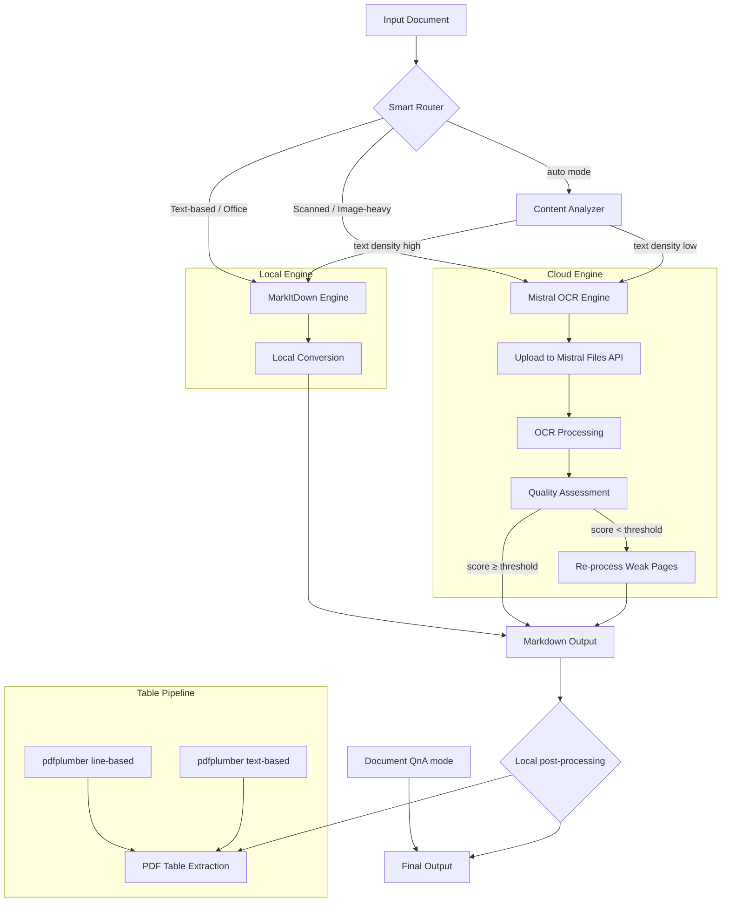

# Architecture

This document describes the high-level architecture of the Enhanced Document Converter.

## System Overview

The converter uses a **dual-engine** design: a local MarkItDown engine for fast, offline processing and a cloud-based Mistral AI OCR engine for high-fidelity document understanding.

## Module Responsibilities

| Module                 | Role                                                                                         |
| ---------------------- | -------------------------------------------------------------------------------------------- |
| `config.py`            | Environment loading, path setup, runtime constants, validation                               |
| `utils.py`             | Logging, caching (SHA-256 + TTL), table formatting, file validation, YAML frontmatter        |
| `schemas.py`           | Pydantic models and JSON schemas for structured extraction (invoices, contracts, etc.)       |
| `local_converter.py`   | MarkItDown wrapper, low-quality output detection, PDF table extraction, PDF to images        |
| `mistral_converter.py` | Mistral OCR client, upload/process/batch, QnA streaming, SSRF validation, image optimization |
| `main.py`              | CLI entry point, smart routing, concurrent processing, interactive menu, system status       |

## Data Flow

1. **Input** — User provides file path, URL, or directory. Dotfiles (`.gitkeep`, `.DS_Store`) are silently excluded from input scanning.
2. **Routing** — Smart router analyzes content to pick the best engine
3. **Conversion** — Selected engine produces Markdown. When MarkItDown processes image or PDF inputs that yield minimal text, a warning is logged suggesting Mistral OCR.
4. **Caching** — Results cached by SHA-256 content hash (24h TTL)
5. **Post-processing** — Optional pdfplumber table extraction on local/PDF paths. Bbox/document structured fields are returned by the **Mistral OCR** call when enabled (not a separate post-pass on markdown). **Document QnA** is a separate mode (chat over a document URL), not an automatic follow-up to conversion.
6. **Output** — Markdown saved to `output_md/`, plain text to `output_txt/`

## Output Naming

`utils.safe_output_stem()` prevents filename collisions:

- **Files in `input/`**: When two files share the same stem (e.g., `report.pdf` and `report.docx`), each output gets an `_ext` suffix (`report_pdf.md`, `report_docx.md`).
- **Files from other directories**: A 6-character SHA-256 hash of the full path is appended to guarantee uniqueness.

## System Status and Diagnostics

System Status mode (`--mode status` or `--test`) reports:

- **Configuration** — API key, OCR model, cache duration, concurrency limits
- **Optional Features** — Runtime checks for ffmpeg, pydub, youtube_transcript_api, and olefile availability
- **Cache Statistics** — Hit rate, entry count, total size
- **Output Statistics** — File counts across output directories

## Batch OCR

Batch mode submits 10+ documents to Mistral Batch API at reduced cost. After submission, the CLI emits a machine-readable `BATCH_JOB_ID=<id>` line for automation and scripting, in addition to the human-readable confirmation message.
