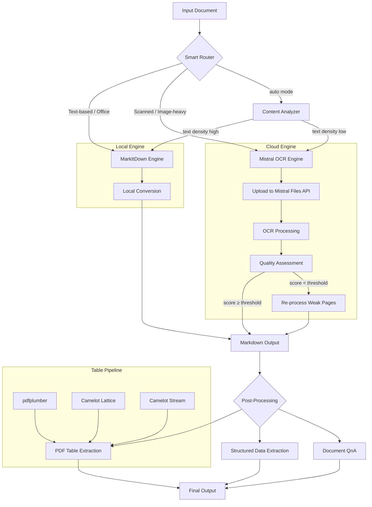

# Architecture

This document describes the high-level architecture of the Enhanced Document Converter.

## System Overview

The converter uses a **dual-engine** design: a local MarkItDown engine for fast, offline processing and a cloud-based Mistral AI OCR engine for high-fidelity document understanding.

## Module Responsibilities

| Module | Role |
|--------|------|
| `config.py` | Environment loading, path setup, runtime constants, validation |
| `utils.py` | Logging, caching (SHA-256 + TTL), table formatting, file validation, YAML frontmatter |
| `schemas.py` | Pydantic models and JSON schemas for structured extraction (invoices, contracts, etc.) |
| `local_converter.py` | MarkItDown wrapper, PDF table extraction (pdfplumber + Camelot), PDF to images |
| `mistral_converter.py` | Mistral OCR client, upload/process/batch, QnA streaming, SSRF validation, image optimization |
| `main.py` | CLI entry point, smart routing, concurrent processing, interactive menu |

## Data Flow

1. **Input** — User provides file path, URL, or directory
2. **Routing** — Smart router analyzes content to pick the best engine
3. **Conversion** — Selected engine produces Markdown
4. **Caching** — Results cached by SHA-256 content hash (24h TTL)
5. **Post-processing** — Optional table extraction, structured extraction, or QnA
6. **Output** — Markdown saved to `output_md/`, plain text to `output_txt/`
